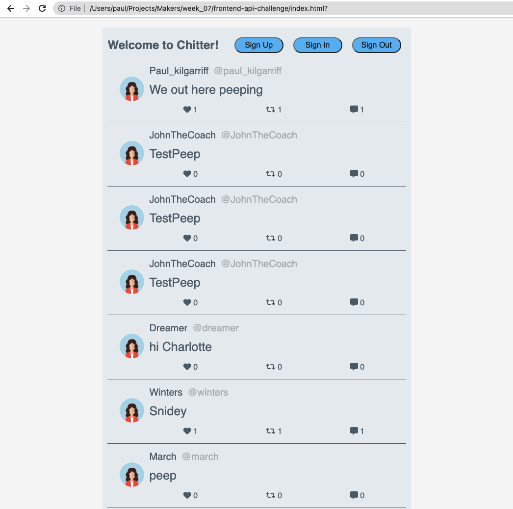

# Chitter API Frontend Challenge

## Description

Implement a frontend in JavaScript for a backend application that allows users to interact with a database of 'peeps'

This is the current view of the app after the peeps have loaded. The symbols beneath each peep change colour on hover, and register a click through jQuery event handlers.

## Approach

- Followed the steps in the [Makers Pill](https://github.com/makersacademy/javascript-web-applications/blob/main/pills/setup_minimal_frontend_webapp.md) to set-up a minimal frontend application.
- Diagrammed a [topline overview](#initial-overview-of-app-flow) of the interactions between front and back end.
- Created [User Stories](#user-stories) for the suggested interactions & related functions
- Analysed User Stories for domain modelling
  - extracted objects and actions
- Test-drove chitterApi class
  - installed jest-fetch-mock
  - add getPeepsFromServer method
  - mocked calls to fetch for getPeepsFromServer
- Test-drove chitterModel class
  - add loadNotes method -> maps response from ChitterAPI to local object
- Test-drove chitterView class
  - add displayPeeps method
  - extracted repeated parts to generatePeep method
  - add displayButtons method
- Spent time with the styling of the page
  - added styles.css
  - used examples from:
    - Previous work on [ScareBNB Makers project](https://github.com/adamwoodcock98/makersbnb)
    - [Online Twitter Clone Demo](https://github.com/somanath-goudar/html-css-projects/tree/master/twitter-clone)
    - [Codecademy CSS Course](https://www.codecademy.com/learn/learn-css)
  - Page now has a login form that slides into view based on a jQuery event handler
  - Peeps load (slowly) with a placeholder avatar image, the handle of the author, and the peep body
  - Peeps also have a footer that contains FontAwesome symbols to represent likes, repeeps, and comments
    - these change colour when hovering -> CSS pseudoelements
    - the icons and numbers aren't quite linked currently (can change colour independently)

> BLOCKER: I don't know how to save session information in a JavaScript frontend
>
> - This is preventing any dynamic loading of the sign in/up/out buttons
> - Along with blocking off page interaction to logged-in users

## Next Steps

- I would like to know how to save session data in this type of app
  - would allow me to implement the Session and Authorised User sections of the user stories
- I would like to use Bootstrap more effectively to create an anchored navbar at the top of the page that moves with the view
- I would be interested in swapping the sliding login form for a modal login form that pops up over the rest of the page
- I would like to introduce the User class
  - initial thought would be that it is separate from peeps, but contains references t the users peeps
  - would explore this through diagramming

---

# Appendix

## Technologies Used

- JavaScript (Node.js)
- jQuery
- Fetch -> making the API requests within the program
- Jest (Current Coverage: 92.3%)
  - special shoutout to the incomprehensible mocking while modifying the DOM
- BootStrap | FontAwesome - external stylesheets
- ~Travis CI~ -> Couldn't get Jest working reliably enough locally to involve CI
- Postman -> for exploring the backend API

## User Stories

> As a Chitter user 
> So that I can keep track of the thoughts of the world 
> I would like to _view a list_ of the last 50 **peeps** posted to Chitter 

> As a Chitter user 
> So that I can really focus on the meaning of a peep 
> I would like to _view a single_ **peep** by itself 

> As an unregistered user 
> So that I can participate in the online conversation 
> I would like to \*make an **account\*** on Chitter 

> As a Chitter user 
> So that only I can interact as myself on Chitter 
> I would like to _log in_ to my **account** on Chitter 

> As a logged-in Chitter user 
> So that I can swithc off occasionally 
> I would like to _log out_ of my **account** on Chitter 

> As a Chitter User 
> So that I can share my thoughts with the world 
> I would like to _post_ a **peep** to Chitter 

> As a Chitter User 
> So that I don't have to defend my incoherent ramblings from the past 
> I would like to be able to _delete_ one of my **peeps** 

> As a Chitter User 
> So that I can express my joy at another user's peep 
> I would like to be able to _add a like_ to a **peep** 

> As a Chitter User 
> So that I can make a stranger on the internet feel bad 
> I would like to be able to _unlike_ a **peep** that I previously liked 

## Diagrams

### Initial Overview of App Flow

